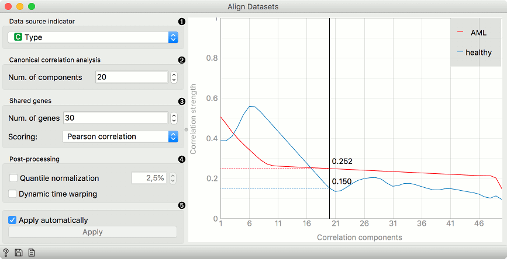

Align Datasets
==============

Alignment of multiple datasets with a diagram of correlation visualization.

**Inputs**
- Data: single cell dataset

**Outputs**
- Transformed Data: aligned data
- Genes per n. Components

1. Data source indicator
2. Number of components for canonical correlation analysis.
3. Number of shared genes and the scoring method for alignment. Scoring can be done with [Pearson](https://en.wikipedia.org/wiki/Pearson_correlation_coefficient), [Spearman](https://en.wikipedia.org/wiki/Spearman%27s_rank_correlation_coefficient) and [Biweights midcorrelation](https://en.wikipedia.org/wiki/Biweight_midcorrelation).
4. Tick the box to use the percent of quantile normalization and dynamic time warping.
5. If *Apply automatically* is ticked, the results will be communicated automatically. Alternatively, press *Apply*.

