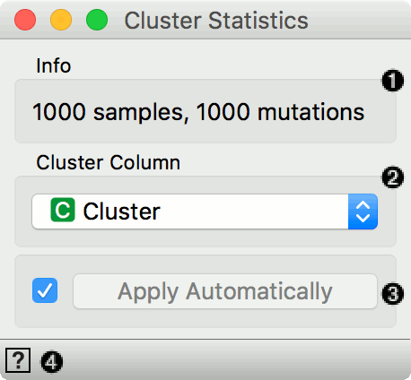

Cluster Statistics
==================

Compute variant calling statistics for clusters.

Inputs
    Data
        input dataset

Outputs
    Data
        dataset with cluster scores per gene

The **Cluster Statistics** widget computes cluster statistics per gene in a dataset.

1. Information on the input.
2. Column with cluster label.
3. Apply changes. If *Apply automatically* is ticked, changes will be communicated automatically. Alternatively, click *Apply*.
4. Access help.

Example
-------

[todo]
