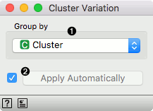

Cluster Variation
=================

Compare expressions in groups of samples.

Inputs
    Data
        input dataset
Outputs
    Data
        dataset with a differential expression column
        

Input to a **Cluster Variation** widget is a data set, where cells have been clustered or provided with some domain-specific label. In other words, the data has to contain a meta feature (column) with a cluster identifier, where each cell has to a member of exactly one cluster. The widget computes cluster-specific differential expression of all the genes in the data set, where expression within the cluster of cells is compared to the expression outside the cluster. Differential expression is computed as a logarithm of mean expression of a gene within the cluster of cells divided by mean expression of the same gene in cells outside the cluster.

1. Selection of a meta feature (column) in the input data that reports on cluster labels.
2. Tick to automatically process input data and send the result of scoring to the output. If left unchecked, processing must be triggered manually.

Example
-------

[todo]
