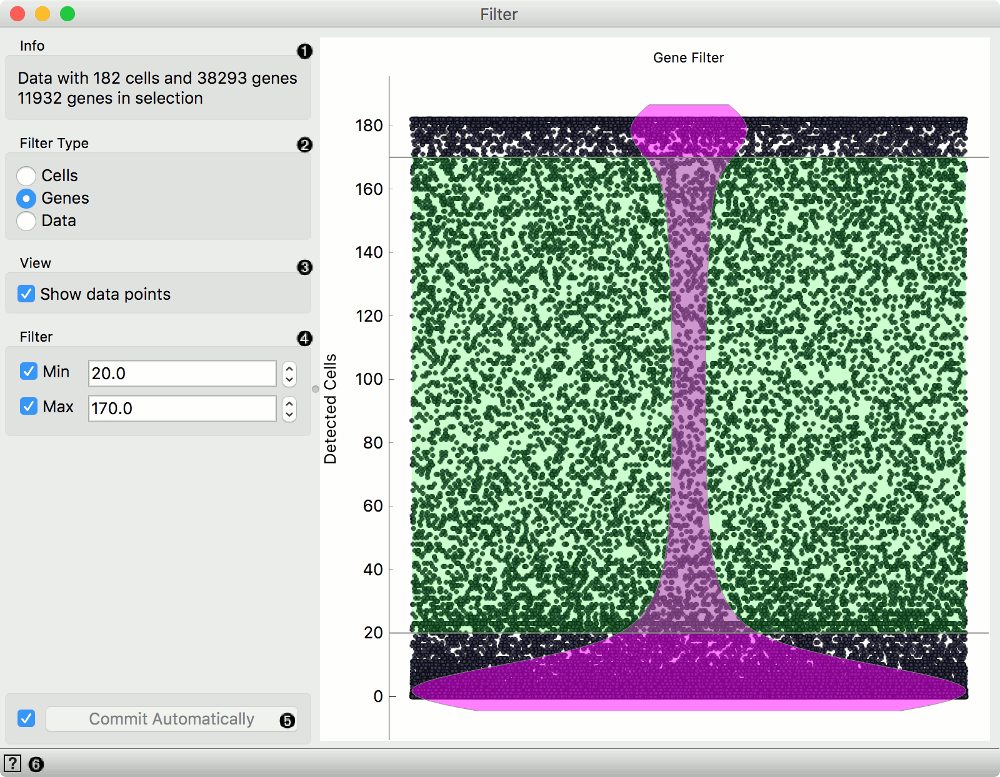
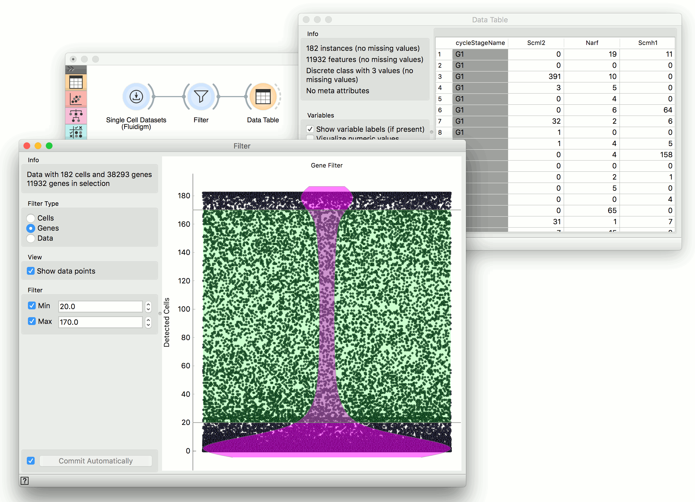

Filter
======

Filter cells/genes.

**Inputs**
- Data: input dataset

**Outputs**
- Data: filtered dataset

The **Filter** widget filters cells or genes by the number of positive measurements. One can select genes in visualization to remove the unfrequent and overly frequent cells/genes.

1. Information on the input and output.
2. Filter by cells (rows), genes (columns) or data (remove zero measurments).
3. If the box is ticked, data points are displayed.
4. Filter by lower and upper threshold.
5. Apply changes. If *Commit automatically* is ticked, changes will be communicated automatically. Alternatively, click *Commit*.
6. Access help.

Example
-------

The **Filter** widget is used for filtering uninteresting cells, genes or data. By uninteresting we mean too frequent, too unfrequent or where data is zero (no expression). This allows us to have leaner data sets, which speeds up computation and enables easier analysis of results.

We have used [ingle Cell Datasets](singlecelldatasets) to load *Cell cycle in mESC (Fluidigm)* data set. Then we used **Filter** widget to narrow down the selection of genes from 38,293 to 11,932. The width of our data table (number of columns) has descreased significantly. We have set the selection here manually (20 for lower and 170 for upper threshold), but you can also set the selection in the visualization by dragging the green field up or down.

