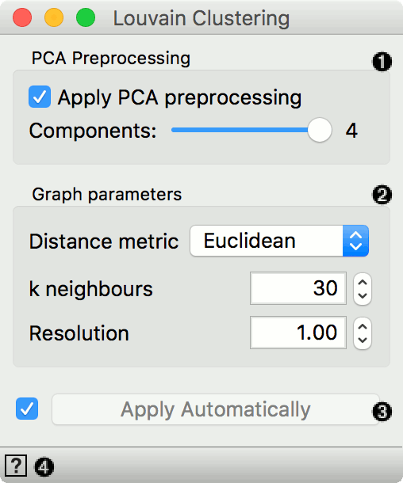
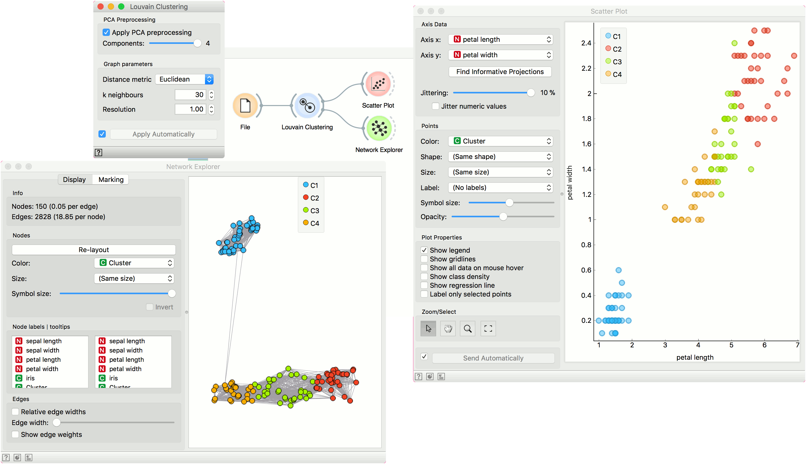

Louvain Clustering
==================

Detects communities in a network of nearest neighbours.

Inputs
    Data
        input dataset

Outputs
    Data
        dataset with a new cluster label
    Network
        network graph

The **Louvain Clustering** widget is a non-parametric clustering based on community detection in networks using the `Louvain method <http://iopscience.iop.org/article/10.1088/1742-5468/2008/10/P10008/pdf>`_. The `method <https://en.wikipedia.org/wiki/Louvain_Modularity>`_ optimizes network modularity by looking at in-group versus out-of-group edge density.

1. If '*Apply PCA preprocessing*' is ticked, data will be transformed with PCA prior to clustering. Slider enables you to select the number of PCA components for clustering, maximum is 50.
2. Graph parameters:
   - Use `Euclidean <https://en.wikipedia.org/wiki/Euclidean_distance>`_ or `Manhattan <https://en.wiktionary.org/wiki/Manhattan_distance>`_ distance metric.
   - Set k-neighbors for local clustering.
   - Resolution at which to observe the network. Default of 1.0 returns the macro level.
3. Apply changes. If *Apply automatically* is ticked, changes will be communicated automatically. Alternatively, click *Apply*.
4. Access help.

Example
-------

We use *iris* data set for this simple example. Load *iris* with the **File** widget and send it to **Louvain Clustering**. The widget computes clustering and outputs the data with an additional column with cluster labels. Connect **Scatter Plot** to **Louvain Clustering** to observe the discovered clusters. In **Scatter Plot**, set the Color option to *Cluster*. Louvain recognized 4 clusters, Iris setosa, Iris virginica and Iris versicolor clusters, with the fourth cluster being at an intersection of virginica and versicolor.

If you have the Network add-on installed, you can connect **Network Explorer** to **Louvain Clustering** and observe the clusters in a network.

