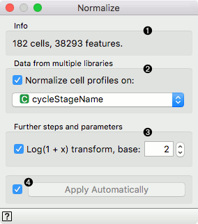

Normalize
=========

Gene scoring based on statistics of their expression profiles or information content about cell types.

Inputs
    Data
        input data set

Outputs
    Data
        normalized data
    Preprocessor
        preprocessing method

Input to the **Normalize** widget is a raw count gene expression data matrix with cells in rows and genes in columns. The widget implements a two-step normalization. In the first step, the data is equalized so that for all the cells in a *group* their median expression value is equal. Zero-valued entries are ignored. In the second step, the data is log-transformed.

The widget outputs, along with normalized data, also a normalization preprocessor. It can be sent to widgets for modeling and model scoring that can use normalization as one of its preprocessing steps.

1. Information about the input single cell expression data.
2. Equalization step. The cells with the same value of a chosen categorical feature form a group. If no feature is chosen, all cells in the data set will be equalized to have the same gene expression mean.
3. Log transform of the gene expression values.
4. Tick to automatically process input data and send the result of normalization to the output. If left unchecked, normalization must be triggered manually.
