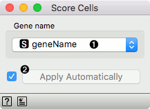

Score Cells
===========

Add a cell score based on the given set of genes.

**Inputs**
- Data: input dataset
- Genes: dataset with gene names

**Outputs**
- Data: dataset with a meta column reporting on cell scores

**Score Cells** scores the cells (rows) in the input data based on expression of input marker genes. Input data has to include gene names in column headers (as attribute names). The score is computed independently for each cell and is equal to the maximum expression of the marker genes. If expressions for all the marker genes are missing, the cell obtains a score of zero. If *Genes* input is provided, one of the columns must include names of genes that match those from expression data.

1. A column name from table on genes that provides names of genes that are included in the input gene expression table.
2. Tick to automatically process input data and send the result of scoring to the output. If left unchecked, processing must be triggered manually.

Example
-------

We will use [Single Cell Datasets](singlecelldatasets) widget to load *Bone marrow mononuclear cells with AML (sample)* data. Then we will pass it through **k-Means** and select 2 clusters from Silhouette Scores. Ok, it looks like there might be two distinct clusters here.

But can we find subpopulations in these cells? Let us load *Bone marrow mononuclear cells with AML (markers)* with [Single Cell Datasets](singlecelldatasets). Now, pass the marker genes to **Data Table** and select, for example, natural killer cells from the list (NKG7).

Pass the markers and k-Means results to **Score Cells** widget and select *geneName* to match markers with genes. Finally, add [t-SNE](tsne) to visualize the results.

In [t-SNE](tsne), use *Scores* attribute to color the points and set their size. We see that killer cells are nicely clustered together and that t-SNE indeed found subpopulations.

