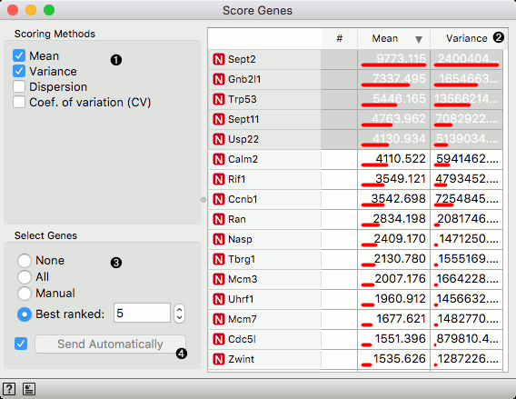

Score Genes
===========

Gene scoring based on statistics of their expression profiles or information content about cell types.

**Inputs**
- Data: input dataset
- Scorer: (multiple) prediction model(s)

**Outputs**
- Reduced Data: expression data containing selected genes
- Scores: gene scores

The **Score Genes** widget considers gene expression data with genes in columns and single cell
expression profiles in rows. It scores the genes based on statistics of gene expression. For examples, it can sort
the genes by their mean expression. The widget supports selection of best scored genes and performs gene filtering.

1. Scoring method. Those selected will be shown in the scoring table.
2. Table with gene scores. Click on the column header to sort by specific score.
3. Gene scoring method. If set to *Manual* than gene selection includes those whose rows in gene scored table
   are selected (click on rows and use modifer keys). *Best ranked* will include top-ranked genes under selected
   gene sorting.
4. If *Send Automatically* is ticked, the widget automatically outputs the data according to chosen selection
   method. This option should be used to automatically update the output of the widget upon any change of the
   input data set.

Scoring methods
---------------

1. Mean: [arithmetic mean](https://en.wikipedia.org/wiki/Mean) gene expression, computed across all the cells in the input data.
2. Variance: [squared deviation from gene expression mean](https://en.wikipedia.org/wiki/Variance)
3. Dispersion: the deviation of gene expression variance from the mean,
   see also [negative binomial distribution](https://en.wikipedia.org/wiki/Negative_binomial_distribution)
4. Coefficient of variation: [relative standard deviation](https://en.wikipedia.org/wiki/Coefficient_of_variation)
   of a gene expression. Measures relative variability of gene expression, and is the ratio of the standard deviation to the mean.
