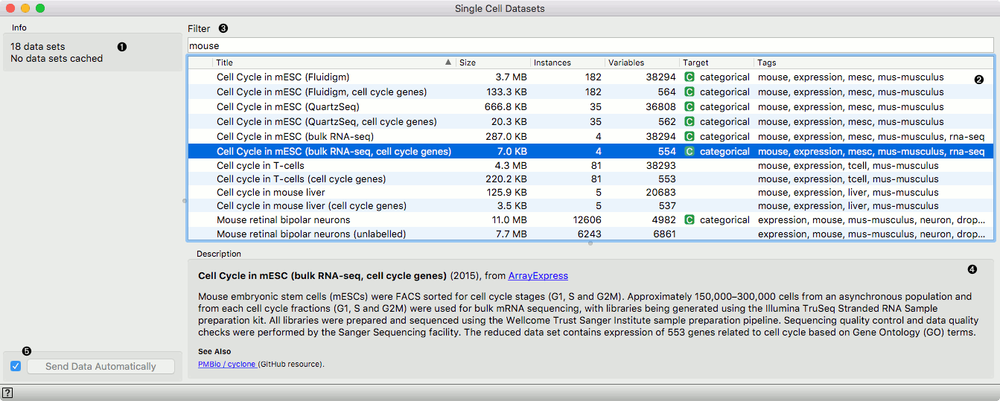

Single Cell Datasets
====================

Load a single cell data from an online repository.

**Outputs**
- Data: A single cell dataset containing cells and their gene expression or gene markers.

**Single Cell Datasets** retrieves a selected data set from the data base server and sends the data to the output. Gene expression data sets include cells in rows and genes in columns. The data set file is downloaded to the local memory, and for subsequent requests instantly available
even without the internet connection.

1. Information on the number of data sets available and the number of them downloaded to the local memory.
2. List of available data sets with information on the number of cells (instances) and genes (variables).
3. Textual description of the selected data set and its source.
4. If *Send Data Automatically* is ticked, selected data set automatically loaded and pushed to the output of the widget. Notice that some data sets are big and downloading them may take time. Alternatively, uncheck the *Send Data Automatically*, browse through the data set list and press *Send Data* upon finding a suitable one for analysis.
