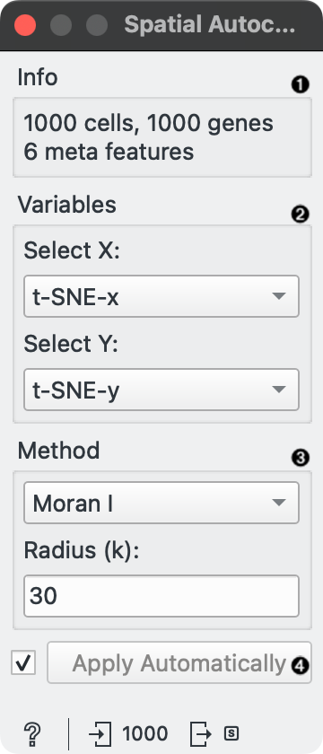

Spatial Autocorrelation Scorer
==============================

Calculate Moran's I or Geary's C spatial autocorrelation score based on input gene expression data.

**Inputs**

- Data: input dataset with spatial coordinates and gene expression values

**Outputs**

- Scorer: an instance of SpatialScorer containing the adjacency matrix and selected method for scoring

**Spatial Autocorrelation Scorer** calculates the spatial autocorrelation score (Moran's I or Geary's C) for each gene in the dataset. The input dataset must include gene expression values in columns and spatial coordinates (x and y) in selected columns. The adjacency matrix is computed using k-nearest neighbors based on the spatial coordinates. The scores are computed independently for each gene.

1. Information about the input data.
2. Select X and Y columns that provide spatial coordinates for each cell.
3. Select the method for calculating spatial autocorrelation (Moran I or Geary C) and specify the number of nearest neighbors (k) for constructing the adjacency matrix.
4. Tick to automatically process input data and send the result to the output. If left unchecked, processing must be triggered manually.

Example
-------

We will use [Single Cell Datasets](single_cell_datasets.md) widget to load *Bone marrow mononuclear cells with AML (sample)* data. Then we will pass it through **t-SNE** to get the spatial coordinates of the cells. We will pass the data to the **Spatial Autocorrelation Scorer** widget, select *t-SNE-x* and *t-SNE-y* as spatial coordinates, and calculate Moran's I score with 30 nearest neighbors.

We pass the scorer and the data to **Rank** widget to get the top 10 genes with the highest Moran's I score and visualize the results in **Scatter Plot**.

